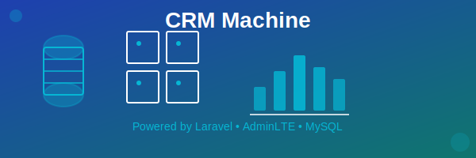

# CRM Machine (Laravel + AdminLTE)

## Descripción del proyecto

CRM Machine es un sistema CRM desarrollado en Laravel con interfaz AdminLTE. Incluye módulos CRUD para Clientes, Empleados, Proveedores, Productos y Altos Cargos e incluye una base de datos MySQL para la gestión de la información. La finalidad del proyecto es centralizar y agilizar la administración de operaciones comerciales, permitiendo registrar, consultar y mantener datos de forma ordenada para apoyar la toma de decisiones y el seguimiento del negocio.

## Requisitos para ejecutarlo

- PHP 8.2+ (con extensiones de Laravel: OpenSSL, PDO, Mbstring, Tokenizer, XML, Ctype, JSON, BCMath)
- Composer
- Node.js y NPM (solo si se requiere compilar assets)
- MySQL/MariaDB
- Servidor web local (XAMPP/Apache)

## Pasos básicos de instalación

1. Clonar el repositorio o copiar el proyecto en el directorio web.

2. Instalar dependencias PHP:

	- "bash"
	- "composer install"

3. Crear el archivo `.env` y configurar la base de datos:

    - Configurar DB en `.env` (por defecto: DB_DATABASE=adminlte, DB_USERNAME=root, DB_PASSWORD=).

4. Generar la clave de la aplicación:

    - php artisan key:generate

5. Ejecutar migraciones:

	- php artisan migrate

6. Iniciar el servidor:
	
	- php artisan serve

7. Abrir en el navegador:

	- http://127.0.0.1:8000

## Usuario y contraseña de prueba

Actualmente no hay autenticación configurada. Si se agrega login en el futuro, este apartado se actualizará con credenciales utilizables.

